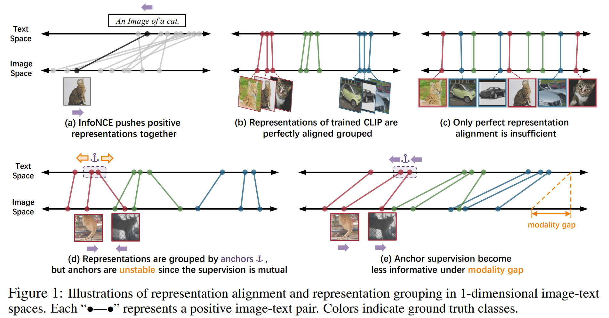
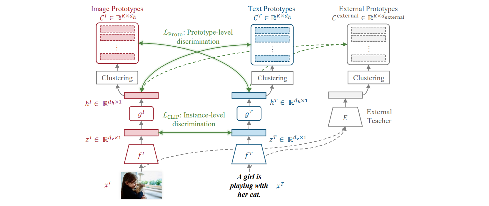

# **Prototypical Contrastive Language Image Pretraining**
Welcome to the official PyTorch implementation of ProtoCLIP in our paper *[ProtoCLIP: Prototypical Contrastive Language Image Pretraining](https://arxiv.org/abs/2206.10996)*, in IEEE Transactions on Neural Networks and Learning Systems (TNNLS).

by
[Delong Chen](https://chendelong.world/), 
Zhao Wu, 
[Fan Liu](https://multimodality.group/), 
Zaiquan Yang, 
Shaoqiu Zheng,
[Ying Tan](https://www.cil.pku.edu.cn/), and
Erjing, Zhou

> **Abstract**:
> Contrastive Language Image Pretraining (CLIP) received widespread attention since its learned representations can be transferred well to various downstream tasks. During CLIP training, the InfoNCE objective aims to align positive image-text pairs and separate negative ones. In this paper, we show a representation grouping effect during this process: the InfoNCE objective indirectly groups semantically similar representations together via randomly emerged within-modal anchors. 
> 
> We introduce **Proto**typical **C**ontrastive **L**anguage **I**mage **P**retraining (ProtoCLIP) to enhance such grouping by boosting its efficiency and increasing its robustness against modality gap. Specifically, ProtoCLIP sets up prototype-level discrimination between image and text spaces, which efficiently transfers higher-level structural knowledge. We further propose **P**rototypical **B**ack **T**ranslation (PBT) to decouple representation grouping from representation alignment, resulting in effective learning of meaningful representations under large modality gap. PBT also enables us to introduce additional external teachers with richer prior knowledge. ProtoCLIP is trained with an online episodic training strategy, which makes it can be scaled up to unlimited amounts of data. 
> 
> Combining the above novel designs, we train our ProtoCLIP on Conceptual Captions and achieved an +5.81% ImageNet linear probing improvement and an +2.01% ImageNet zero-shot classification improvement. 





🔔 **Updates**

- **2022-06-23**: Preprint of ProtoCLIP paper is available on ArXiv. See [this url](https://arxiv.org/abs/2206.10996). 
- **2022-06-22**: Initial release of ProtoCLIP training code. 

🚀 **What can you get from this repo**
- Training CLIP and loading pretrained CLIP weights via OpenCLIP.
- ProtoCLIP implementation.
    - Episodic training
    - Prototypical losses, Prototype Back Translation (PBT)
    - RoBERTa external teacher
- Evaluations of CLIP and ProtoCLIP, including:
    - Zero-shot classification evaluations on 10 downstream datasets.
    - MS-COCO retrieval and [modality gap](https://arxiv.org/abs/2203.02053) evaluations.
    - Pytorch-based fast linear probing.
    - Clustering evaluations: Adjusted Rand Index (ARI) and Adjusted Mutual Information (AMI).
- ProtoCLIP visualizations: TSNE and clustered samples.
- Experimental support of loading pretrained language model as text tower initialization.

# Requirements

## 1. Install Dependencies
- Create a conda environment and install PyTorch:

    ```bash
    conda create -n protoclip python=3.8
    conda activate protoclip
    ```

    This repo requirs PyTorch (1.11.0) and torchvision. Please install them via https://pytorch.org/get-started/locally

- Clone this repo:

    ```bash
    git clone https://github.com/megvii-research/protoclip
    cd protoclip
    export PYTHONPATH="$PYTHONPATH:$PWD/src"
    ```
    **Note**: If import error is occured later, run `export PYTHONPATH="$PYTHONPATH:$PWD/src"` again.

- Install additional dependencies:
    ```bash
    conda install pandas scikit-learn faiss-gpu ftfy tqdm matplotlib pycocotools
    pip install pytorch-transformers
    conda install wandb # if you want to use wandb for better logging
    ```
    **Note**: This codebase integrates [pytorch-transformers](https://pypi.org/project/pytorch-transformers) to initalize the text tower with large pretrained language model (experimental).


## 2. Prepare Pretraining Data
This codebase reads a `CSV` file (separated by `\t`) with two columns: a path to an image ("filepath" by default), and a text caption ("title" by default).

| filepath          | title                      |
|-------------------|----------------------------|
| path/to/image.jpg | A very typical bus station |
| ...               | ...                        |

The script `src/utils/gather_cc.py` will collect the [Conceptual Captions](https://github.com/google-research-datasets/conceptual-captions) (CC3M) dataset. First, download the Conceptual Captions URLs from [here](https://ai.google.com/research/ConceptualCaptions/download), then run the following script:

```bash
python3 src/utils/gather_cc.py path/to/Train_GCC-training.tsv
```

**Note**: The requirement of CC3M validation data of OpenCLIP is removed in this codebase. The CC3M dataset was made public by Google in 2018. As noted in our paper, the number of accessible images keeps drooping due to expired image links. This issue is raised by several recent works. In this work, since we can only collect 2,643,718 images (concurrent to our work, [CyCLIP](https://arxiv.org/abs/2205.14459) collected 2,631,703 images), we randomly sample a 2,500,000 subset (75\% of full CC3M) from them to train our ProtoCLIP. Considering the dropping accessibility of image links in Conceptual Captions, we call for the use of this dataset size (2.5M) in future benchmarking for better comparability.

**Note**: `webdataset` is no longer supported in this codebase.


## 3. Prepare Downstream Data
- **Zero-shot Classification**. The preprocessed zero-shot datasets can be downloaded from [CLOOB](https://github.com/ml-jku/cloob#downstream-tasks).

- **Linear Probing**. We perform linear evaluation on ImageNet, CIFAR10, CIFAR100, and STL10. You need to download the full [ImageNet-1k](https://image-net.org/download.php) dataset manually. The later three datasets are integrated into `torchvision` and will be downloaded automatically.

- **Image-text Retrieval**. We implement zero-shot image-text retrieval on MS-COCO. Since we do not perform fine-tuning, only the validation split (`/val2017`) is required here.

    
    ```
    # All downstream datasets shall be stored to <YOUR DATASET ROOT> dictionary:
    <YOUR DATASET ROOT>
        ├── imagenet
        │   ├── train
        │   └── test  
        ├── birdsnap
        │   └── test
        ├── country211
        │   └── test
        ├── flowers102
        │   └── test
        ├── gtsrb
        │   └── test
        ├── stanford_cars
        │   └── test
        ├── ucf101
        │   ├── testlist01
        │   ├── testlist02
        │   └── testlist03   
        └── coco2017
           ├── annotations
           └── val2017 
    ```

# Evaluation
- **Evaluation of pretrained ProtoCLIP**

    **TODO**: Model checkpoint release.
    
    ```bash
    python src/training/main.py \
        --eval-data-dir '/data/Datasets' --batch-size 32  --workers 8 \
        --zeroshot-frequency 1 --retrieval-frequency 1 --linear-frequency 1 \
        --linear-prob-mode pytorch \
        --add-projection-head \
        --model RN50  --resume 'RELSEASED_CHECKPOINT.pt' 
    ```

- **Evaluation of pretrained CLIPs**

    This implementation is based on an awesome CLIP re-implementation [OpenCLIP](https://github.com/mlfoundations/open_clip). The codebase is developed from version `1.2.1` of OpenCLIP. Therefore, in this codebase, you can also load various pretrained models, as in OpenCLIP. To evaluate these models, you can specify the `--model` and `--pretrained` arguments to `main.py`:
    
    ```bash
    python src/training/main.py \
        --eval-data-dir '/data/Datasets' --batch-size 32  --workers 8 \
        --zeroshot-frequency 1 --retrieval-frequency 1 --linear-frequency 1 \
        --linear-prob-mode pytorch \
        --model RN50  --pretrained openai 
    ```

    To list available pretrained models:

    ```bash
    >>> import open_clip
    >>> open_clip.list_pretrained()
        [('RN50', 'openai'),
        ('RN50', 'yfcc15m'),
        ('RN50', 'cc12m'),
        ('RN50-quickgelu', 'openai'),
        ('RN50-quickgelu', 'yfcc15m'),
        ('RN50-quickgelu', 'cc12m'),
        ('RN101', 'openai'),
        ('RN101', 'yfcc15m'),
        ('RN101-quickgelu', 'openai'),
        ('RN101-quickgelu', 'yfcc15m'),
        ('RN50x4', 'openai'),
        ('RN50x16', 'openai'),
        ('RN50x64', 'openai'),
        ('ViT-B-32', 'openai'),
        ('ViT-B-32', 'laion2b_e16'),
        ('ViT-B-32', 'laion400m_e31'),
        ('ViT-B-32', 'laion400m_e32'),
        ('ViT-B-32-quickgelu', 'openai'),
        ('ViT-B-32-quickgelu', 'laion400m_e31'),
        ('ViT-B-32-quickgelu', 'laion400m_e32'),
        ('ViT-B-16', 'openai'),
        ('ViT-B-16', 'laion400m_e31'),
        ('ViT-B-16', 'laion400m_e32'),
        ('ViT-B-16-plus-240', 'laion400m_e31'),
        ('ViT-B-16-plus-240', 'laion400m_e32'),
        ('ViT-L-14', 'openai'),
        ('ViT-L-14-336', 'openai')] 
    ```


# Training
## Build an External Teacher (optional)
Pretrained RoBERTa language model as the external teacher for ProtoCLIP. We load the pretrained RoBERTa-large weights provided by [FAIRSEQ](https://github.com/facebookresearch/fairseq) via [PyTorch Hub](https://pytorch.org/hub/pytorch_fairseq_roberta/). Run the following script to extract text features from a given `.csv` file, and reduce the feature dimension from 1024 to 64 by PCA to save memory cost:


```bash
python src/utils/RoBERTa.py
>>> Input your csv file: <YOUR-PRETRAING-DATASET-CSV-FILE.csv>
>>> Input your feature file: <FEATURE-CACHE-FILE.npy> (e.g, 'features/RoBERTA_features_CC.npy')
```

With a single NVIDIA 2080Ti GPU, extracting RoBERTa features from CC2.5M takes about 3 hours and the resulting feature file takes 600+Mb storage. 

**Note**: We used the pooled and normalized feature from RoBERTa:
```bash
text_feature = roberta.extract_features(texts)
text_feature = text_feature.mean(dim=1)
text_feature = F.normalize(text_feature, dim=-1)
```

## Sample Single GPU Training
By running commands provided below, following results can be obtained. On a machine with single NVIDIA 2080ti GPU, 16 CPU, and 100GB RAM, CLIP training takes 1.03 days, while ProtoCLIP training takes 1.84 days.

|   Model   | Backbone | Batch    Size |ImageNet    Linear Prob | ImageNet    Zero-shot | 10 Dataset Zero-shot Avg. | COCO    Mean Recall |
|:---------:|:--------:|:-------------:|:----------------------:|:---------------------:|:-------------------------:|:-------------------:|
|    CLIP   |   RN50   |            64 | 38.95                  | 12.29                 | 15.30                     | 26.20               |
| ProtoCLIP |   RN50   |            64 | 44.55                  | 14.50                 | 20.48                     | 28.26               |
    

- Train CLIP baseline with ResNet-50 backbone on CC2.5M for 8 epoch, using a single NVIDIA 2080ti GPU:
    ```bash
    python src/training/main.py \
        --dataset-size 2500000 --episode-size 2500000 \
        --train-data '<YOUR-PRETRAING-DATASET-CSV-FILE.csv>' \
        --eval-data-dir '<YOUR DATASET ROOT>' \
        --epochs 8 --save-frequency 2 --batch-size 64 --workers 16 \
        --linear-frequency 8  --zeroshot-frequency 8 --retrieval-frequency 8 \
        --model RN50  --lr 5e-5 --warmup 2000 --wd 0.5 --max-grad-norm 10 \
        --report-to 'tensorboard' --logs logs/single_gpu --copy-codebase \
        --name 'CLIP'
    ```
- Train ProtoCLIP with ResNet-50 backbone on CC2.5M for 8 epoch, using a single NVIDIA 2080ti GPU:
    ```bash
    python src/training/main.py \
        --dataset-size 2500000 --episode-size 200000 \
        --train-data '<YOUR-PRETRAING-DATASET-CSV-FILE.csv>' \
        --eval-data-dir '<YOUR DATASET ROOT>' \
        --augmentation protoclip-light-augmentation \
        --epochs 100 --infonce-warmup-epoch 1 --lit-start-epoch 99 --save-frequency 25 --visualize-frequency 25 --batch-size 64 --workers 16 \
        --clustering-frequency 1 --k 20000 --kmeans-max-iter 20 --kmeans-nredo 3 \
        --linear-frequency 100  --zeroshot-frequency 100 --retrieval-frequency 100 \
        --model RN50  --lr 5e-5 --warmup 2000 --wd 0.5 --max-grad-norm 10 \
        --w-clip 1 --w-proto 1 --w-proto-external 1 --external-teacher '<FEATURE-CACHE-FILE.npy>' \
        --add-projection-head --projection-dim 128 --target-temperature 0.01 --PBT \
        --report-to 'tensorboard' --logs logs/single_gpu --copy-codebase \
        --name 'ProtoCLIP'
    ```
    
## Multi GPU Training
CLIP and ProtoCLIP achieve the following downstream performance with CC2.5M:
    
|   Model   | Backbone | Batch    Size |  ImageNet   Linear Prob | ImageNet    Zero-shot |  10 Dataset Zero-shot Avg.| COCO    Mean Recall |
|:---------:|:--------:|:-------------:|:-----------------------:|:---------------------:|:-------------------------:|:-------------------:|
|    CLIP   |   RN50   |           512 | 49.41                   | 19.46                 | 21.87                     | 36.48               |
| ProtoCLIP |   RN50   |           512 | 55.22                   | 21.47                 | 22.52                     | 35.69               |

- Train CLIP baseline with ResNet-50 backbone on CC2.5M for 32 epoch, using 8 NVIDIA 2080ti GPU:
    ```bash
    torchrun --nproc_per_node 8 -m training.main \
        --dataset-size 2500000 --episode-size 2500000 \
        --train-data '<YOUR-PRETRAING-DATASET-CSV-FILE.csv>' \
        --eval-data-dir '<YOUR DATASET ROOT>' \
        --epochs 32 --save-frequency 4 --batch-size 64 --workers 16 \
        --linear-frequency 32  --zeroshot-frequency 32 --retrieval-frequency 32  \
        --model RN50  --lr 5e-4 --warmup 15625 --wd 0.5 --max-grad-norm 10 \
        --report-to 'tensorboard' --logs logs/CC2.5M_32ep_benchmark --copy-codebase \
        --name 'CLIP'
    ```
- Train ProtoCLIP with ResNet-50 backbone on CC2.5M for 32 epoch, using 8 NVIDIA 2080ti GPU:
    ```bash
    torchrun --nproc_per_node 8 -m training.main \
        --dataset-size 2500000 --episode-size 200000 \
        --train-data '<YOUR-PRETRAING-DATASET-CSV-FILE.csv>' \
        --eval-data-dir '<YOUR DATASET ROOT>' \
        --augmentation protoclip-light-augmentation \
        --epochs 400 --infonce-warmup-epoch 1 --lit-start-epoch 399 --save-frequency 50 --visualize-frequency 50 --batch-size 64 --workers 16 \
        --clustering-frequency 1 --k 20000 --kmeans-max-iter 20 --kmeans-nredo 3 \
        --linear-frequency 400  --zeroshot-frequency 400 --retrieval-frequency 400  \
        --model RN50  --lr 5e-4 --warmup 15625 --wd 0.5 --max-grad-norm 10 \
        --w-clip 1 --w-proto 1 --w-proto-external 1 --external-teacher '<FEATURE-CACHE-FILE.npy>' \
        --add-projection-head --projection-dim 128 --target-temperature 0.01 --PBT \
        --report-to 'tensorboard' --logs logs/CC2.5M_32ep_benchmark --copy-codebase \
        --name 'ProtoCLIP'
    ```

    **Note**: Multi node distributed training is not supported yet.

## Some Notes on Arguments
Run `python src/training/main.py --help` to see descriptions of all arguments. Here we provide some explanations of our newly added arguments:


- `--dataset-size` trunk the samples with the specified number. To train model with CC2.5M as in the ProtoCLIP paper, use `--dataset-size=2500000`

- `--episode-size` enables episode training. We randomly select `args.episode_size` (e.g., 0.2M) samples from the entire dataset as an episode by `index_mapping[:] = torch.from_numpy(np.random.choice(args.dataset_size, args.episode_size, replace=True)).share_memory_()`. Note that we use `.share_memory_()` to make the `index_mapping` to be consistant across different subprocess when multiple GPUs are used. It can also be used for dataset shuffling (see this [issue](https://github.com/mlfoundations/open_clip/issues/101)) by setting episode size = dataset size.

- `--add-projection-head` creates MLP projection heads for image and text towers. ProtoCLIP checkpoints must be loaded with this argument, otherwise, state dict mismatch error will occurred.

- `--PBT` enables Prototype Back Translation. It is a prerequisite of applying `--external-teacher`.

- `--linear-prob-mode` we implemented faster pytorch based linaer regression. Specify `--linear-prob-mode=sklearn` to run sklearn L-BGFS logistic regression on CPU (slow).

- `--visualize-frequency` enable T-SNE and cluster visualization for ProtoCLIP. You may want to do visualization sparsely since both of them are time-consuming. Setting `--visualize-frequency=-1` as default to skip visualization.

- `--pretrained-text` is experimental. It is not used in our ProtoCLIP paper. To load a pretrained $\text{RoBERTa}_\text{base}$, specify `--pretrained-text='roberta-base'`

- `--resume` you can add `--resume='/path/to/your/checkpoints/epoch_xx.pt'` to resume training.

## 📈Monitoring Downstream Performances During Training

Experiment will be logged to `<Your Experiment Log dir>` as following:
```
<Your Experiment Log dir>
    ├── cache
    ├── checkpoints
    │   ├── epoch_4.pt
    │   ├── epoch_8.pt
    │   ├── epoch_12.pt
    │   ├── epoch_16.pt
    │   ├── epoch_20.pt
    │   ├── epoch_24.pt
    │   ├── epoch_28.pt
    │   ├── epoch_32.pt
    │   └── epoch_latest.pt
    ├── out.log
    ├── params.txt
    ├── results.jsonl
    ├── evaluation_metrics_all.csv
    └── tensorboard
        └── events.out.tfevents
```

We present an useful tool for monitoring the downstream performance. By running `src/utils/evaluate_checkpoints.py` and specifying an experiment logging dir, it will read configurations from `params.txt` and automatically monitor and evaluate checkpoints. The result will be automatically saved as a `.csv` file (`evaluation_metrics_all.csv`). You can also specify an individual checkpoint to evaluate.
```
>>> python src/utils/evaluate_checkpoints.py
Please input your experiment dir: <Your Experiment Log dir>
Specify a checkpoint epoch? (press "enter" to scan and evaluate all checkpoints) 
```

# 🎈 Aknowledgements

If you find this project useful for your research, please consider citing our paper:

```bibtex
@article{chen2023prototypical,
    author    = {Delong Chen and
                Zhao Wu and
                Fan Liu and
                Zaiquan Yang and
                Shaoqiu Zheng and
                Ying Tan and
                Erjin Zhou},
    title     = {ProtoCLIP: Prototypical Contrastive Language Image Pretraining},
    journal   = {IEEE Transactions on Neural Networks and Learning Systems (TNNLS)},
    year      = {2023},
}
```

If you have any problems about ProtoCLIP algorithm or this implementation, create an issue or email chendelong@hhu.edu.cn.
